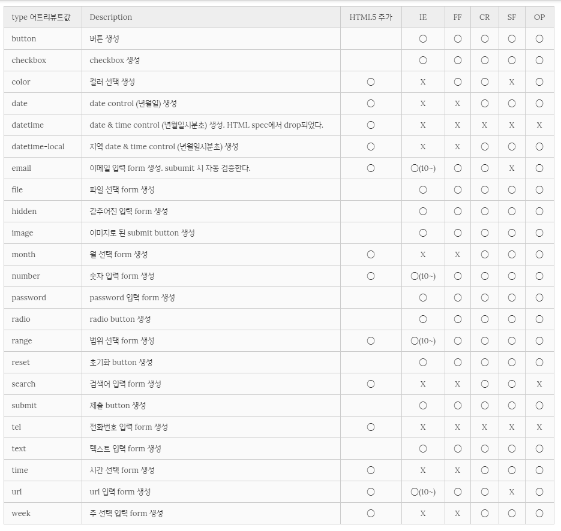
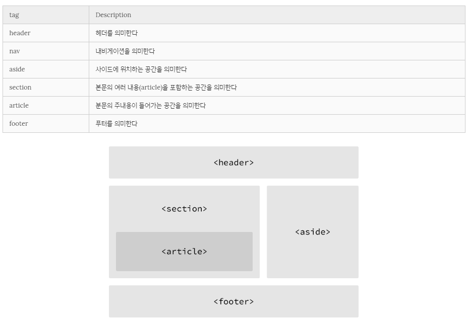

**##HTML**
글로벌 어트리뷰트 
id – 유일 
class – 중복지정 가능 
hidden – 보이지 않으며 의미상으로도 브라우저에 노출 X 
lang – 지정된 요소의 언어를 지정. 검색엔진 크롤링시 언어 인식 가능하도록 
style – 인라인 스타일 지정 
tabindex – 사용자가 키보드로 페이지르 네비게이션 이동 순서를 지정 
title – 요소에 관한 제목을 지정 

**시맨틱 웹 **
시맨틱 태그란 브라우저, 검색엔지느 개발자 모두에게 콘텐츠의 의미를 명확히 설명하는 역할 
시맨틱 태그를 통해 컴퓨터가 HTML요소를 보다 명확히 해석하고 그 데이터를 활용할 수 있는 시맨틱 웹이 실현될 수 있다. 
( non -semantic : div span등, semantic : form, table, img, header, aside, nav, article, footer 등 ) 

**태그 **
em/ – 가장 중요한 text를 지정 ( i 태그와 마찬가지로 이탤릭 체로 표기된다 ) 
mark/ - highlight text 지정 
del/ - deleted text지정 ( 가로로 한줄로 줄이 그어져 있음 ) 
ins/ - 밑줄 표시 
sub, sup – subscripted를 정의하며 각각 아래, 위에 표시된다. 
pre/ - 형식화된 text를 정의, 작성된 그대로의 형식으로 브라우저에 표시된다. 
q/ - 큰따옴표로 요소를 감싼다.(인용문) 
blockquote/ - 해당 태그 안에 있는 요소들은 들여쓰기 된다. 
a/ - mailto:메일주소 , href=”javascript:alert(‘Hello’);”, file, #등의 href 속성  )  
    target=”_blank 사용가능”

**표, 리스트 **
ol/ – 순서가 있는 리스트, ul/ - 순서가 없는 리스트 

input 태그는 데이터를 입력받기 위한 태그이다. 
아래는 type 어트리뷰트에 들어갈 수 있는 값이다. 

 

-	IE 에서 동작하지 않으므로 주의 

 
 
 

 ****
 
 
 
